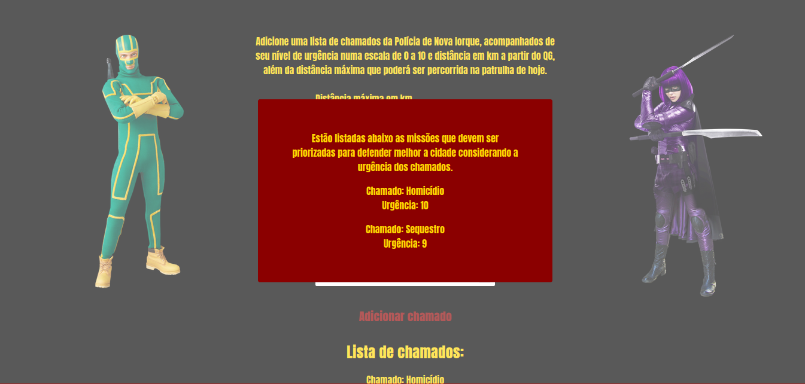

# Kick-Ass

**Número da Lista**: 42 
**Conteúdo da Disciplina**: Programação dinâmica 

## Alunos
|Matrícula | Aluno |
| -- | -- |
| 17/0045269  |  Sara Campos |

## Sobre 
Esse projeto visa aplicar o algoritmo de Knapsack com abordagem de programação dinâmica no contexto de um sistema que seleciona quais missões devem ser priorizadas numa patrulha considerando os fatores de urgência e distância (ida e volta do QG). 

## Screenshots

## Instalação 
**Linguagem**: JavaScript 
**Framework**: React 

Para rodar o projeto é necessário após a clonagem do repositório e dentro da raiz do projeto rodar os seguintes comandos: 

    cd kick-ass
    npm install
    npm start

## Uso 
Após acessar o projeto no browser, o usuário irá encontrar uma página com algumas informações que o encaminhará para adicionar os chamados. Já nesta página de formulário, ele poderá informar a distância máxima que poderão percorrer na noite de patrula e adicionar quais os chamados, a distância e urgência de cada um. A partir daí o algoritmo irá retornar as missões que devem ser priorizadas.

## Vídeo 
O vídeo explicando o projeto pode ser acessado através da pasta assets na raiz do projeto após a clonagem do repositório.
